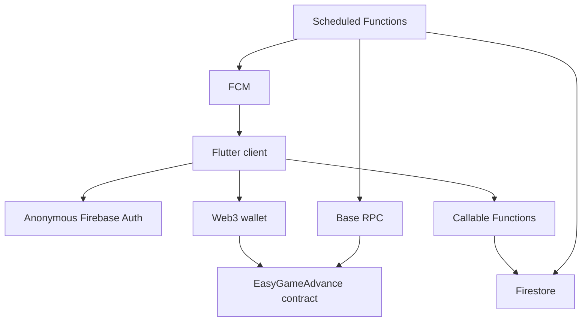

# Firebase backend security audit

Дата: 2026-07-08  
Область: Firebase Functions, Firestore rules, Flutter Firebase bridge, wallet-link flow.

## Remediation status

Часть рисков уже закрыта после первичного аудита:

- `SEC-001` — **частично закрыто**: добавлен Firestore-backed rate limiting для `requestWalletNonce`, `linkWallet`, `registerDevice`, `trackTransaction`.
- `SEC-002` — **закрыто**: `confirmTransactions` теперь проверяет, что `receipt.from` совпадает с linked wallet.
- `SEC-003` — **частично закрыто**: production UI больше не показывает private-key форму; legacy dev-код ещё остаётся в проекте и должен быть удалён отдельным cleanup-этапом.
- `SEC-004` — **частично закрыто**: public `health` больше не отдаёт полный checkpoint/contract/block hash, только минимальный статус.
- `SEC-005` — **частично закрыто**: добавлены длина/формат FCM token, allowlist platform и cap активных token docs.
- `SEC-006` — **закрыто**: nonce consumption переведён на Firestore transaction.
- `SEC-007` — **открыто как deployment/config task**: нужен контроль production App Check config.
- `SEC-008` — **открыто как schema discipline task**: публичные projection collections нельзя смешивать с приватным профилем.

## Executive summary

Firebase backend перенесён в правильной архитектуре: смарт-контракт остаётся source of truth, Cloud Functions индексируют события и подтверждают транзакции, Firestore закрыт на запись для клиента, callable-функции требуют anonymous Firebase Auth и App Check. Главные production-риски сейчас не в прямом доступе к деньгам, а в abuse/cost/availability: нет rate limiting на callable-функциях, `trackTransaction` не проверяет ownership транзакции по `receipt.from`, `health` открыт публично, FCM token registration слишком мягко валидируется. Отдельно остаётся критичный legacy-риск проекта: старые private-key wallet flows всё ещё присутствуют во Flutter-коде и должны быть удалены из основного пути.

## Skills used

- `security-best-practices` — JavaScript/Node backend security review.
- `security-threat-model` — repo-grounded threat modeling.
- `firebase-security-rules-auditor` — Firestore rules red-team validation.

## In-scope evidence

- `/functions/index.js`
- `/functions/game_abi.js`
- `/functions/package.json`
- `/firebase.json`
- `/firestore.rules`
- `/lib/app/services/firebase_backend_service.dart`
- `/lib/app/services/wallet_connect_service.dart`
- Legacy private-key evidence:
  - `/lib/app/services/contract_linking.dart`
  - `/lib/app/services/wallet_service.dart`
  - `/lib/app/models/user.dart`
  - `/lib/app/modules/home/views/home_view.dart`

## System model



### Primary trust boundaries

| Boundary | Data | Existing controls | Main gaps |
|---|---|---|---|
| Flutter → callable Functions | wallet, signature, FCM token, tx hash | Firebase Auth, App Check, input checks | no rate limiting, incomplete tx ownership verification |
| Functions → Base RPC | logs, receipts, contract reads | `BASE_RPC_URL` secret, fixed contract address param | public RPC may throttle; no backoff/dead-letter strategy |
| Functions → Firestore | indexed events, wallet links, tx statuses | Admin SDK only, Firestore client writes denied | broad read rules for public projection |
| Functions → FCM | notifications by wallet token | token hash doc id, invalid token cleanup | token length-only validation, no per-wallet token cap enforcement |
| Public internet → `health` | indexer checkpoint | CORS disabled | endpoint unauthenticated |

## Firestore rules audit

Score: **4/5**

Rules are generally safe for the current projection model because all client writes are denied. The main caveat is read breadth: any signed-in anonymous user can read `users`, `levels`, and `events`. That is acceptable only while these collections contain public on-chain projection data.

```json
{
  "score": 4,
  "summary": "Strict write denial prevents client-side data integrity attacks. Read access is intentionally broad for public blockchain projection data, but this becomes risky if private profile fields are later stored in the same collections.",
  "findings": [
    {
      "check": "Update Bypass",
      "severity": "minor",
      "issue": "No client create/update/delete is allowed for game projection collections, so update bypass is not currently exploitable.",
      "recommendation": "Keep all projection writes server-only through Admin SDK."
    },
    {
      "check": "Authority Source",
      "severity": "minor",
      "issue": "Rules do not trust request.resource.data for authority. Wallet ownership is enforced in Functions, not rules.",
      "recommendation": "Keep wallet-link writes inside Functions only."
    },
    {
      "check": "Business Logic vs Rules",
      "severity": "minor",
      "issue": "Any signed-in user can read public projection data. This supports UI needs but can leak data if private profile fields are added later.",
      "recommendation": "Separate public on-chain projection collections from private user profile collections."
    },
    {
      "check": "Storage Abuse",
      "severity": "minor",
      "issue": "Rules avoid storage abuse from clients by denying writes. Storage abuse risk shifts to callable Functions.",
      "recommendation": "Add rate limits and size limits in Functions."
    }
  ]
}
```

Evidence:

- `/firestore.rules:9-16` — `users` read allowed to any signed-in user; writes denied.
- `/firestore.rules:19-31` — `levels` and `events` read allowed to any signed-in user; writes denied.
- `/firestore.rules:34-41` — `transactions` and `walletLinks` are owner-readable only.

## Findings

### SEC-001 — No rate limiting on callable Functions

Severity: **High**

Evidence:

- `/functions/index.js:266` — `requestWalletNonce`
- `/functions/index.js:305` — `registerDevice`
- `/functions/index.js:322` — `trackTransaction`

Impact:

An attacker with a valid anonymous Firebase session and App Check token can repeatedly call functions. This can create Firestore writes, Secret/RPC-backed processing load, FCM token writes, and transaction confirmation workload. App Check reduces automated abuse but is not a rate limit.

Recommended mitigation:

- Add per-UID and per-wallet rate limiting in Firestore.
- Suggested limits:
  - nonce request: 5/minute per UID, 20/hour per wallet.
  - register device: 10/hour per UID, max 5-10 active tokens per wallet.
  - track transaction: 20/hour per UID, reject duplicate pending tx for same UID.
- Use Firestore transactions for counters.
- Add structured logs for rate-limit denials.

Priority: **P0 before production deploy**

---

### SEC-002 — `trackTransaction` does not prove transaction belongs to linked wallet

Severity: **High**

Evidence:

- `/functions/index.js:322-335`
- `/functions/index.js:348-356`

Current behavior:

`trackTransaction` accepts any valid-looking tx hash and stores it with the caller UID. `confirmTransactions` later checks only:

- receipt exists,
- `receipt.status === 1`,
- `receipt.to === EASY_GAME_CONTRACT_ADDRESS`.

Missing check:

- `receipt.from` must equal the linked wallet.

Impact:

A linked user can submit someone else’s successful contract transaction hash and make the backend mark it as their tracked transaction. This probably does not steal funds because rewards are contract-controlled, but it can corrupt UI state, analytics, notification attribution, and support/audit trails.

Recommended mitigation:

- In `confirmTransactions`, when `doc.wallet` exists, require:
  - `receipt.from.toLowerCase() === doc.wallet.toLowerCase()`
  - `receipt.chainId` or provider chain matches configured chain.
- If mismatch, mark as `rejected_owner_mismatch`, not `confirmed`.
- Optionally prefetch receipt in `trackTransaction` if already mined.

Priority: **P0 before production deploy**

---

### SEC-003 — Legacy private-key wallet flow remains in project

Severity: **Critical if reachable in production UI**

Evidence:

- `/lib/app/services/contract_linking.dart` references private key input and `EthPrivateKey.fromHex`.
- `/lib/app/services/wallet_service.dart` creates credentials from private keys.
- `/lib/app/models/user.dart` stores `privateKey`.
- `/lib/app/modules/home/views/home_view.dart` contains UI text asking user to paste a private key.

Impact:

If this flow is reachable in production, users may paste private keys into the app. That is the highest-risk class for a Web3 product: wallet compromise, irreversible fund loss, and reputational failure.

Recommended mitigation:

- Remove private-key input/storage from production code.
- Delete or fully isolate legacy lottery/private-key services behind dev-only flags.
- Add a CI grep guard that fails builds on `privateKey`, `EthPrivateKey.fromHex`, and “Enter your private key” in production paths.
- Use only injected wallet / Base Account signing.

Priority: **P0 cleanup before production**

---

### SEC-004 — Public unauthenticated `health` endpoint leaks backend status

Severity: **Medium**

Evidence:

- `/functions/index.js:360-364`

Impact:

The endpoint exposes indexer checkpoint data to anyone. This is not a direct compromise, but it gives attackers operational visibility: whether indexer is stuck, current block checkpoint, and possibly contract/indexing status.

Recommended mitigation:

Options:

1. Keep public but minimize output:
   - return only `{ ok: true }`;
   - no block/hash/contract details.
2. Protect with a simple secret header stored as `defineSecret`.
3. Restrict to Firebase/GCP monitoring if used only internally.

Priority: **P1**

---

### SEC-005 — FCM token registration has weak validation and no visible token cap

Severity: **Medium**

Evidence:

- `/functions/index.js:305-319`
- `/functions/index.js:75-90`

Current behavior:

`registerDevice` checks only token type and minimum length, then stores the token under the linked wallet. `pushToWallet` reads only 20 tokens, but registration itself does not enforce a hard cap.

Impact:

A linked wallet can accumulate many token documents and increase storage/notification work. Malicious or malformed token strings can be stored until FCM cleanup catches invalid ones.

Recommended mitigation:

- Enforce maximum token length, e.g. 4096 chars.
- Allowlist `platform` values.
- Store `createdAt`, `lastSeenAt`, and expire old tokens.
- Enforce max tokens per wallet/UID.
- Reject excessive updates with rate limiting.

Priority: **P1**

---

### SEC-006 — Wallet nonce consumption should be transactional

Severity: **Medium**

Evidence:

- `/functions/index.js:285-301`

Current behavior:

`linkWallet` reads nonce, verifies, then performs a batch update setting `used: true`. Two concurrent calls could both read `used: false` before either update lands.

Impact:

The replay window is narrow and does not directly allow linking to a wallet without a valid signature. But using a Firestore transaction is the correct security shape for one-time nonce consumption.

Recommended mitigation:

- Wrap nonce read/check/update and wallet link write in a Firestore transaction.
- Re-check `used` and `expiresAt` inside the transaction.
- Delete or TTL old nonce docs.

Priority: **P1**

---

### SEC-007 — App Check activation depends on production build configuration

Severity: **Medium**

Evidence:

- `/lib/app/services/firebase_backend_service.dart:45-54`
- `/functions/index.js:266`, `/functions/index.js:285`, `/functions/index.js:305`, `/functions/index.js:322`

Current behavior:

Backend callable Functions enforce App Check. Flutter activates App Check in production, or in debug only when `FIREBASE_RECAPTCHA_V3_SITE_KEY` is provided.

Impact:

Production is safe if the app is built with real App Check config. Development/staging builds without the key cannot call protected functions unless debug App Check is configured. Risk is mostly deployment/config drift.

Recommended mitigation:

- Document required `--dart-define=FIREBASE_RECAPTCHA_V3_SITE_KEY=...`.
- Add startup warning if web production has no site key.
- Configure Firebase App Check enforcement in console for Functions after testing.

Priority: **P1**

---

### SEC-008 — Broad public projection reads need collection separation before adding private profile data

Severity: **Medium**

Evidence:

- `/firestore.rules:9-31`

Impact:

Any anonymous signed-in user can read `users`, `levels`, and `events`. That is okay for public blockchain-derived data, but unsafe if later user profile fields, preferences, notification settings, or off-chain identity are merged into the same docs.

Recommended mitigation:

- Keep public projection in:
  - `publicUsers`
  - `publicLevels`
  - `events`
- Put private data in:
  - `privateUsers/{uid}`
  - `walletLinks/{uid}`
- Add rule tests before changing schema.

Priority: **P2**

---

### SEC-009 — Dependency hygiene warning: Firebase Functions package reported outdated by CLI

Severity: **Low/Medium**

Evidence:

- Firebase deploy dry-run reported `firebase-functions` outdated.
- `/functions/package.json:13-17`

Impact:

Not necessarily exploitable, but serverless dependencies should stay current because the Functions runtime is internet-facing and handles auth/FCM/Firestore operations.

Recommended mitigation:

- Run `npm audit --omit=dev` inside `/functions`.
- Upgrade `firebase-functions` and `firebase-admin` deliberately.
- Re-run `node --check`, Firebase dry-run, and emulator smoke tests.

Priority: **P2**

## Existing strong controls

1. Secret isolation:
   - `/functions/index.js:15` uses `defineSecret("BASE_RPC_URL")`.

2. Fixed contract configuration:
   - `/functions/index.js:16-19` uses deployment params, not client-supplied contract address.

3. App Check and Firebase Auth on state-changing callable functions:
   - `/functions/index.js:266`, `/functions/index.js:285`, `/functions/index.js:305`, `/functions/index.js:322`.

4. Wallet ownership proof:
   - `/functions/index.js:271-281` creates nonce/message.
   - `/functions/index.js:294-297` verifies `personal_sign`.

5. Firestore client writes denied:
   - `/firestore.rules:11`, `/firestore.rules:15`, `/firestore.rules:21`, `/firestore.rules:25`, `/firestore.rules:31`, `/firestore.rules:36`, `/firestore.rules:41`.

6. Idempotent event IDs:
   - `/functions/index.js:62-63` uses `chainId_txHash_logIndex`.

7. Scheduled functions constrained:
   - `/functions/index.js:250-256` and `/functions/index.js:339-345` use `maxInstances: 1`.

## Top abuse paths

1. Cost/DoS via callable spam:
   - attacker creates anonymous sessions,
   - passes App Check,
   - calls nonce/register/track functions repeatedly,
   - Firestore writes and scheduled processing grow.

2. False transaction attribution:
   - attacker links own wallet,
   - submits another user’s successful EasyGame tx hash,
   - backend marks transaction as confirmed for attacker UID,
   - UI/analytics/support data become misleading.

3. Private-key compromise through legacy UI:
   - user sees old private-key input,
   - pastes wallet private key,
   - key is held in app state/storage path,
   - wallet may be compromised.

4. Operational probing:
   - attacker calls public health endpoint,
   - observes indexer lag/stuck status,
   - times abuse or support/social attacks around backend degradation.

5. Notification token abuse:
   - linked user registers many or malformed tokens,
   - backend stores token docs,
   - notification fanout/cost and cleanup load increase.

## Recommended fix order

1. **P0** — Add ownership validation for tracked transactions.
2. **P0** — Add callable rate limiting.
3. **P0** — Remove/isolate legacy private-key flow from production.
4. **P1** — Make nonce linking transactional and TTL nonce docs.
5. **P1** — Harden FCM token registration limits.
6. **P1** — Restrict or minimize `health`.
7. **P1** — Lock App Check production config/documentation.
8. **P2** — Separate public projection docs from future private profile docs.
9. **P2** — Dependency audit and planned upgrades.

## Manual review focus paths

| Path | Why it matters | Related findings |
|---|---|---|
| `/functions/index.js` | Main backend trust boundary and all Cloud Function entry points | SEC-001, SEC-002, SEC-004, SEC-005, SEC-006 |
| `/firestore.rules` | Determines client read/write capabilities | SEC-008 |
| `/lib/app/services/firebase_backend_service.dart` | Client App Check/Auth/callable integration | SEC-007 |
| `/lib/app/services/wallet_connect_service.dart` | Wallet signature path | SEC-006, SEC-007 |
| `/lib/app/services/contract_linking.dart` | Legacy private-key flow | SEC-003 |
| `/lib/app/services/wallet_service.dart` | Legacy private-key credential creation | SEC-003 |
| `/lib/app/models/user.dart` | Legacy private-key storage model | SEC-003 |
| `/lib/app/modules/home/views/home_view.dart` | Legacy private-key UI prompt | SEC-003 |

## Assumptions and open questions

Assumptions:

- `users`, `levels`, and `events` are intended to contain public blockchain projection data only.
- Firebase Functions will be deployed on Blaze but kept within free/low-cost quotas where possible.
- User registration remains wallet-first; anonymous Firebase Auth is only an authorization/session primitive for Functions and rules.
- No server-side private key should ever be introduced for user transactions.

Open questions:

1. Is the legacy lottery/private-key UI still reachable in production navigation?
2. Should `health` be public for external uptime monitoring, or internal-only?
3. What expected production request volume should rate limits target?
